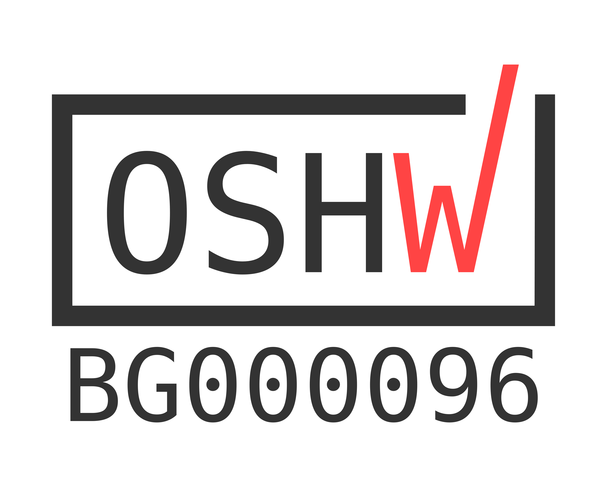

# AVRPICBoard

## Description
This is a [LibrePCB](https://librepcb.org) project!
AVR/PIC Board is a microcontroller module for my Master Degree. 
The module can be used for educational purposes powered by ATtiny85 and PIC10F320.
 Designed By using LibrePCB  software. 
 The target of the project is to use  Assembly languages
  for  AVR/ PIC microcontrollers together.
  It will be used for PhD Degree @ TU-Plovdiv.

## License
Project's hardware is licensed under CC-BY-SA-4.0  
Project's software is licensed under GNU GPL v3 or later  
Project's documentation is licensed under GNU GPL v3 or later  
## OSHWA Certification
This is a [OSHWA Certificated](https://certification.oshwa.org/bg000096.html) project!

## Contact Me
[ Text me throught E-Mail](mailto:vrstanchev@gmail.com)  
Follow me on:   
[GitHub](https://github.com/vrstanchev)  
[LinkedIn](https://www.linkedin.com/in/vrstanchev/)  
[Twitter](https://twitter.com/vrstanchev)  
