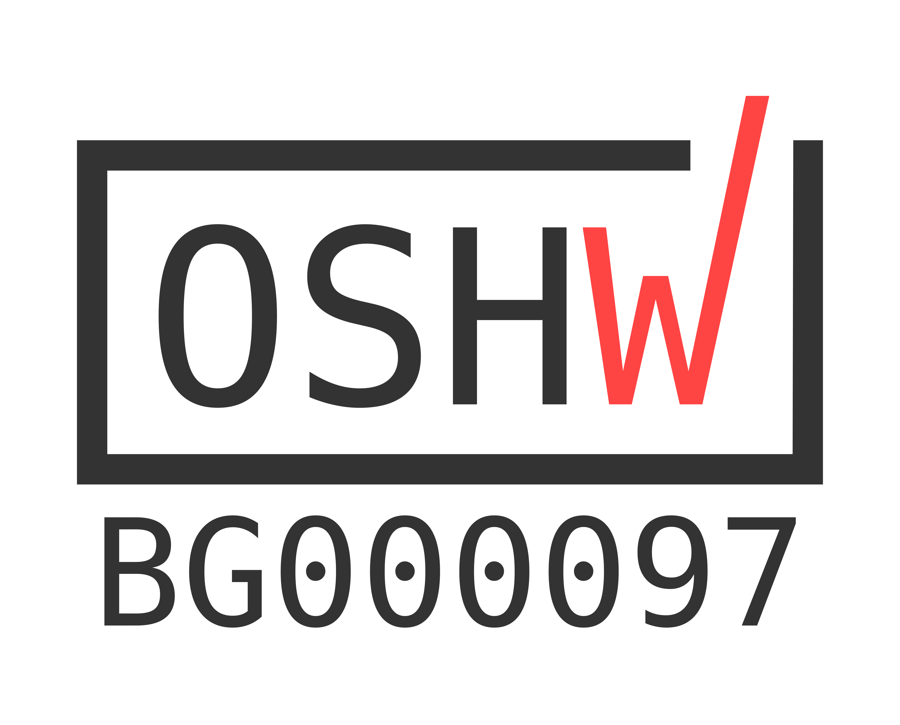

# PPBoard
## Description
This is a [LibrePCB](https://librepcb.org) project!
PIC/PIC Board is a microcontroller module for university purposes. 
The module can be used for educational purposes powered by two PIC10F200 micro-controllers. 
 The target of the project is to use PIC Assembly language.     
  It will be used for PhD Degree @ TU-Plovdiv.
## OSHWA Certification
This is a [OSHWA Certificated](https://certification.oshwa.org/bg000097.html) project!

